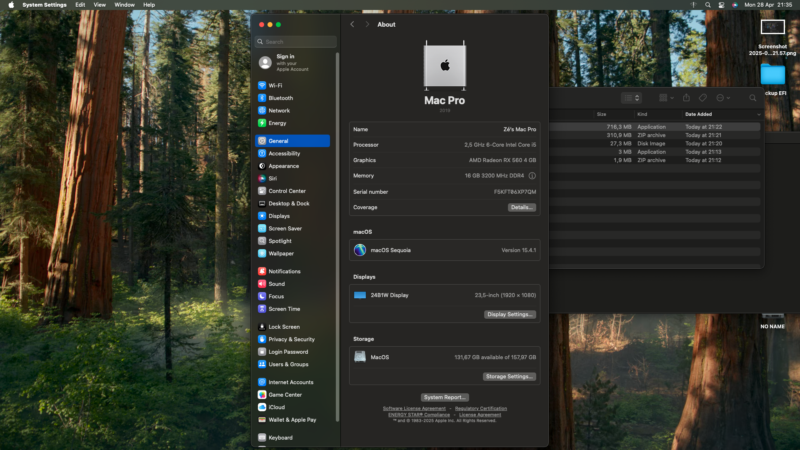
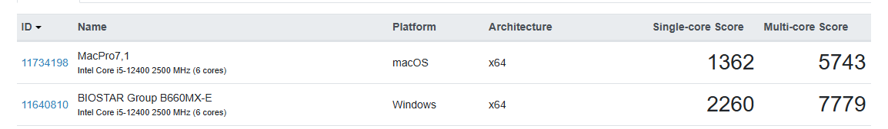
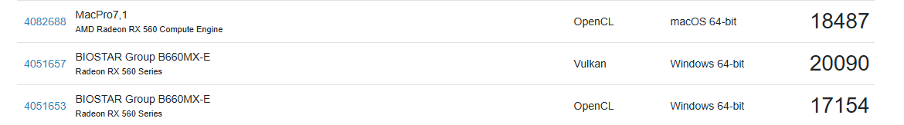

# Hackintosh - Biostar B660MX-E + i5-12400 + RX 560 - OpenCore 1.0.4

---

## Hardware

| Component         | Model                                  |
| ----------------- | -------------------------------------- |
| Motherboard       | Biostar B660MX-E Rev 6.0               |
| Processor         | Intel Core i5-12400 (6c/12t)           |
| RAM               | 1x 16GB DDR4-3200MHz (Single Channel)  |
| GPU               | AMD Radeon RX 560 (Polaris 21 XT)      |
| SSD               | Kingston SA400S37480G (480GB SATA)     |
| Ethernet          | Intel I219V                            |
| Audio             | Realtek ALC897 (not tested)            |

## SMBIOS

| Type    | Model     |
| ------- | --------- |
| SMBIOS  | MacPro7,1 |

## BIOS Settings

**Disable:**
- Fast Boot
- Secure Boot
- Serial/COM Port | Parallel Port
- VT-d (can be enabled if `DisableIoMapper` is set to YES)
- Compatibility Support Module (CSM)
- CFG Lock

**Enable:**
- VT-x
- Above 4G decoding
- Execute Disable Bit
- EHCI/XHCI Hand-off
- SATA Mode: AHCI

**Additional notes:**
- **Above 4G decoding** must be enabled.
- **Resizable BAR Support**: must be disabled.

**Detailed BIOS paths:**

| Path                                                   | Option      |
| ------------------------------------------------------ | ------------ |
| Advanced → CPU Configuration → C6DRAM                  | Enabled      |
| Advanced → CPU Configuration → Intel (VMX) Virtualization Technology | Enabled |
| Advanced → SATA Mode Selection                         | AHCI         |
| Chipset → System Agent (SA) Configuration → Primary Display | PCH PCI    |
| Chipset → System Agent (SA) Configuration → VT-d       | Enabled      |
| Chipset → System Agent (SA) Configuration → Above 4GB MMIO BIOS assignment | Enabled |
| Boot → Boot Configuration → Fast Boot                  | Disabled     |
| Boot → Boot Configuration → CSM Support                | Disabled     |
| Security → System Mode → Secure Boot                   | Disabled     |
| Tweaker → CPU Power Management → CFG Lock               | Disabled     |
| Tweaker → GT Power Management → RC6(Render Standby)     | Disabled     |

## Works

- Audio output via external USB audio interface
- HDMI audio (via RX 560)
- Full graphics acceleration (RX 560 - Metal support)
- Ethernet (Intel I219V)
- USB 2.0 and 3.0 ports (mapped with UTBMap - Via Windows)

## Not Working

- Direct boot from SSD (currently needs USB boot, couldn't fix yet, don't know why)

## Not Tested

- Onboard Audio (Realtek ALC897)
- Facetime
- iMessage
- AirPlay

## Drivers Used (EFI/OC/Drivers)

- AudioDxe.efi
- FirmwareSettingsEntry.efi
- HfsPlus.efi
- OpenCanopy.efi
- OpenRuntime.efi
- ResetNvramEntry.efi

## Tools Used (EFI/OC/Tools)

- ResetNvramEntry
- FirmwareSettingsEntry

## Kexts Used

- AppleALC.kext
- FeatureUnlock.kext
- IntelMausi.kext
- IntelSnowMausi.kext
- Lilu.kext
- RestrictEvents.kext
- SMCProcessor.kext
- SMCSuperIO.kext
- USBToolBox.kext
- UTBMap.kext
- VirtualSMC.kext
- WhateverGreen.kext

---

## Screenshots

---

**Notes:**
- macOS performance is lower than Windows 11 (Geekbench tested).

---

## References

- https://dortania.github.io/OpenCore-Install-Guide/config.plist/comet-lake.html
- https://dortania.github.io/Getting-Started-With-ACPI/
- https://github.com/hackintosh-club/BIOSTAR-B660GTN-OpenCore
- https://github.com/luchina-gabriel/BASE-EFI-INTEL-DESKTOP-12THGEN-ALDER-LAKE-PUBLIC - Special thanks!
